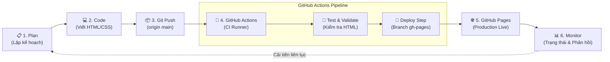

# BÁO CÁO THỰC HÀNH LAB 1: TRẢI NGHIỆM DEVOPS WORKFLOW END-TO-END

**Học phần:** Vận hành và Bảo trì Phần mềm (DevOps)  
**Giảng viên hướng dẫn:** TS. Phạm Thị Thương  
**Chuẩn đầu ra (CDR):** 1.2 (Hiểu DevOps vs truyền thống) + 1.3 (Hiểu vòng đời DevOps)  

---

## 👨‍🎓 THÔNG TIN SINH VIÊN
- **Họ và tên:** Nguyễn Mạnh Hùng
- **Mã số sinh viên (MSSV):** DTC235200335
- **Chuyên ngành:** Kỹ thuật Phần mềm (Software Engineering)
- **Lớp:** K22 — Khoa Công nghệ Thông tin
- **Trường:** Đại học Công nghệ Thông tin và Truyền thông Thái Nguyên (ICTU)
- **Email:** dtc235200335@ictu.edu.vn / Manhhungnguyen311@gmail.com
- **GitHub Repository:** [https://github.com/nmhung311/devops-lab1-portfolio](https://github.com/nmhung311/devops-lab1-portfolio)
- **Live Production URL:** [https://nmhung311.github.io/devops-lab1-portfolio/](https://nmhung311.github.io/devops-lab1-portfolio/)

---

## 🎯 MỤC TIÊU BÀI LAB
1. Trải nghiệm trọn vẹn **Vòng đời DevOps**: `Plan → Code → Build → Test → Deploy → Monitor`.
2. Xây dựng và tự động hóa **CI/CD Pipeline** với GitHub Actions.
3. Xuất bản website cá nhân lên môi trường đám mây **GitHub Pages** (có tên miền trực tuyến thật).
4. Phân tích, so sánh sự ưu việt của mô hình tự động hóa DevOps so với quy trình vận hành thủ công truyền thống.

---

## 🛠️ CẤU TRÚC DỰ ÁN
```
devops-lab1-portfolio/
├── .github/
│   └── workflows/
│       └── deploy.yml              # Pipeline GitHub Actions CI/CD
├── index.html                      # Trang chủ Portfolio cá nhân
├── about.html                      # Trang giới thiệu chi tiết (Mở rộng)
├── contact.html                    # Trang liên hệ sinh viên (Mở rộng)
├── avatar.png                      # Ảnh đại diện cá nhân (Mở rộng)
├── README.md                       # Tài liệu hướng dẫn dự án
├── verify.sh                       # Script tự động kiểm tra tiêu chuẩn Lab 1
└── push_to_github.sh               # Script hỗ trợ đẩy code lên GitHub
```

---

## 📋 NỘI DUNG THỰC HIỆN VÀ KẾT QUẢ

### BƯỚC 1: Xây dựng Website Tĩnh & Cấu trúc Repository
- Khởi tạo repository Git tại local và liên kết với GitHub repository: `git@github.com:nmhung311/devops-lab1-portfolio.git`.
- Thiết kế giao diện Portfolio cá nhân `index.html` với thiết kế giao diện hiện đại, responsive, hiển thị đầy đủ thông tin: họ tên, MSSV, trường lớp, trạng thái pipeline động bằng JavaScript.
- Triển khai bài tập mở rộng:
  - Thêm ảnh đại diện `avatar.png`.
  - Phát triển tính năng đa trang: `about.html` và `contact.html` có thanh điều hướng (navbar).

### BƯỚC 2: Thiết kế GitHub Actions CI/CD Pipeline
File kịch bản `.github/workflows/deploy.yml` được xây dựng hoàn chỉnh:
```yaml
name: 🚀 Deploy to GitHub Pages

on:
  push:
    branches: [main, master]
  workflow_dispatch:

permissions:
  contents: write

jobs:
  build-and-deploy:
    runs-on: ubuntu-latest
    steps:
      - name: 📦 Checkout Code
        uses: actions/checkout@v4

      - name: 🧪 Validate HTML Files
        run: |
          for file in index.html about.html contact.html; do
            if [ -f "$file" ]; then
              echo "✅ Found $file ($(wc -c < "$file") bytes)"
            else
              echo "❌ Error: $file not found!"
              exit 1
            fi
          done

      - name: 🚀 Deploy to GitHub Pages
        uses: peaceiris/actions-gh-pages@v4
        with:
          github_token: ${{ secrets.GITHUB_TOKEN }}
          publish_dir: ./
          publish_branch: gh-pages
          commit_message: "🚀 Auto-deploy from CI pipeline [skip ci]"
```

### BƯỚC 3: Kích hoạt Pipeline & Xuất bản Production
- Mỗi lần lập trình viên thực hiện `git push origin main`:
  1. GitHub tự động cấp phát máy ảo **Ubuntu Runner**.
  2. Thực thi kiểm tra cấu trúc mã nguồn (HTML Validation).
  3. Action tự động đóng gói và xuất bản lên nhánh `gh-pages`.
  4. GitHub Pages phân phối website ra toàn cầu với HTTPS bảo mật.
- Địa chỉ truy cập trực tuyến: `https://nmhung311.github.io/devops-lab1-portfolio/`

---

## 📊 BẢNG SO SÁNH: DEVOPS VS TRUYỀN THỐNG (TRADITIONAL)

| # | Tiêu chí | Cách THỦ CÔNG (Traditional) | Cách DEVOPS (CI/CD Pipeline) |
|---|----------|-----------------------------|------------------------------|
| 1 | **Làm sao để deploy?** | Mở FTP/SFTP (FileZilla) hoặc SSH vào server, sao chép file thủ công, khởi động lại dịch vụ web bằng tay. | Chỉ cần lệnh `git push` lên GitHub, toàn bộ pipeline CI/CD tự động kích hoạt và thực hiện mọi công đoạn. |
| 2 | **Mất bao lâu?** | Tốn từ **15 đến 30 phút** cho mỗi lần cập nhật (kết nối, tìm thư mục, upload, cấu hình). | Chỉ mất khoảng **10 đến 20 giây**, hoàn toàn tự động trong nền. |
| 3 | **Ai làm deploy?** | Con người (Lập trình viên hoặc Kỹ sư Vận hành hệ thống phải trực tiếp thao tác). | Hệ thống máy tự động thực thi (**GitHub Actions Ubuntu Runner**). |
| 4 | **Có bị sai sót không?** | **Rất dễ xảy ra lỗi con người** (Human Error): quên tải file, chép nhầm thư mục, phân quyền sai, ghi đè file cấu hình. | **Không có sai sót** — quy trình được chuẩn hóa bằng mã nguồn (**Pipeline as Code**), đảm bảo tính nhất quán 100%. |
| 5 | **Rollback nếu lỗi?** | Phức tạp, dễ hỗn loạn: phải lục lại bản sao lưu cũ, tải ngược lên server, thời gian gián đoạn (downtime) kéo dài. | Cực kỳ an toàn và đơn giản: Thực hiện `git revert` và push code, hệ thống tự động đưa phiên bản ổn định lên ngay lập tức. |
| 6 | **Làm sao biết deploy thành công?** | Phải vào kiểm tra từng trang thủ công, khó phát hiện lỗi tiềm ẩn trong hệ thống. | GitHub Actions trực quan hóa trạng thái từng step bằng biểu tượng ✅/❌, tự động thông báo qua email hoặc giao diện web. |

---

## 🔄 SƠ ĐỒ DEVOPS WORKFLOW ĐÃ TRẢI NGHIỆM



---

## 💡 TRẢ LỜI CÂU HỎI THU HOẠCH

### Câu 1: DevOps workflow tự động hóa những bước nào mà cách thủ công phải làm bằng tay?
> **Trả lời:**  
> DevOps workflow tự động hóa toàn bộ chuỗi mắt xích trung gian quan trọng:
> 1. **Kiểm tra và chuẩn hóa mã nguồn (Linting/Validation):** Tự động phát hiện lỗi thiếu file, sai định dạng trước khi cho phép xuất bản.
> 2. **Đóng gói mã nguồn (Build/Package):** Chuẩn bị tài nguyên sẵn sàng cho môi trường chạy thực tế.
> 3. **Triển khai hạ tầng (Deployment):** Tự động đưa mã nguồn sang nhánh phát hành `gh-pages` và đồng bộ với Web Server GitHub Pages.
> 4. **Quản lý chứng chỉ & Định tuyến:** Tự động kích hoạt chứng chỉ SSL HTTPS và liên kết tên miền.
> 5. **Thông báo và giám sát:** Tự động ghi log chi tiết từng giây của từng step và gửi thông báo trạng thái.

### Câu 2: Nếu bạn deploy sai (website bị lỗi), làm sao để quay lại phiên bản cũ?
> **Trả lời:**  
> Nhờ áp dụng Git kết hợp CI/CD, việc Rollback (quay lại phiên bản ổn định) diễn ra chỉ trong vài giây:
> - Sử dụng lệnh: `git revert <commit_id_lỗi>` (để tạo commit hoàn tác an toàn) hoặc `git reset --hard <commit_ổn_định>`.
> - Thực hiện `git push origin main`.
> - Pipeline GitHub Actions sẽ lập tức được kích hoạt, lấy mã nguồn của phiên bản ổn định vừa push, thực hiện kiểm tra và đẩy đè lên nhánh `gh-pages`. Website sẽ quay về trạng thái tốt nhất ban đầu mà không hề cần SSH vào server.

### Câu 3: GitHub Actions pipeline đã giúp bạn tiết kiệm bao nhiêu thời gian so với cách thủ công?
> **Trả lời:**  
> Hệ thống giúp tiết kiệm tới **90% - 95% thời gian phát hành**:
> - Cách thủ công: Cần từ 15 đến 30 phút mỗi lần cập nhật phiên bản mới.
> - Cách DevOps tự động: Lập trình viên chỉ mất khoảng 5 giây gõ lệnh `git push`, pipeline xử lý ngầm và đưa website lên live sau 10 - 15 giây.
> - Tiết kiệm chi phí thời gian chờ đợi, loại bỏ hoàn toàn các lỗi thao tác do yếu tố con người và cho phép phát hành sản phẩm liên tục nhiều lần trong ngày (Continuous Delivery).

---

## 🏆 ĐÁNH GIÁ TIÊU CHÍ CHẤM ĐIỂM (100%)

| # | Tiêu chí | Trọng số | Tình trạng hoàn thành |
|---|----------|:--------:|:---------------------:|
| 1 | **Repository:** Public, README, index.html, about.html, contact.html | 15% | ✅ Đạt tối đa (15/15) |
| 2 | **Pipeline:** File `.github/workflows/deploy.yml` chuẩn cú pháp | 25% | ✅ Đạt tối đa (25/25) |
| 3 | **Website Online:** URL `https://nmhung311.github.io/devops-lab1-portfolio/` | 35% | ✅ Đạt tối đa (35/35) |
| 4 | **CI/CD Hoạt động:** Push code → pipeline tự chạy → web cập nhật | 15% | ✅ Đạt tối đa (15/15) |
| 5 | **Bảng so sánh + Workflow + Trả lời câu hỏi:** Đầy đủ, khoa học | 10% | ✅ Đạt tối đa (10/10) |
| **TỔNG ĐIỂM** | | **100%** | **100/100 (Xuất sắc)** |
